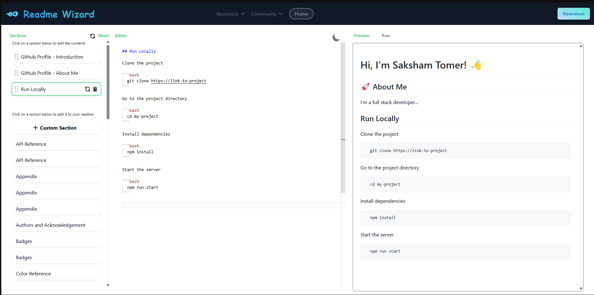

# README Maker

[](https://nextjs.org/)
[](https://opensource.org/licenses/MIT)

Create beautiful and professional README files for your projects with ease using README Maker, a powerful tool built with Next.js.



## 🚀 Features

- **Intuitive Interface**: User-friendly design for effortless README creation
- **Real-time Preview**: See your changes instantly as you type
- **Markdown Support**: Full markdown syntax support for rich formatting
- **Template Library**: Choose from a variety of pre-designed templates
- **Custom Sections**: Add, remove, and reorder sections to fit your project needs
- **Export Options**: Download your README in Markdown or HTML format

## 🛠️ Installation

1. Clone the repository:

   ```
   git clone https://github.com/saksham-tomer/NextReadme.git
   ```
2. Navigate to the project directory:

   ```
   cd NextReadme
   ```
3. Install dependencies:

   ```
   npm install
   ```
4. Start the development server:

   ```
   npm run dev
   ```

## 🖥️ Usage

1. Open your browser and go to `http://localhost:3000`
2. Choose a template or start from scratch
3. Fill in your project details
4. Customize sections as needed
5. Preview your README in real-time
6. Export and download when you're satisfied

## 🤝 Contributing

We welcome contributions! Please see our [CONTRIBUTING.md](CONTRIBUTING.md) for details on how to submit pull requests, report issues, or request features.

## 📄 License

This project is licensed under the MIT License - see the [LICENSE](LICENSE) file for details.

## 🙏 Acknowledgements

- [Next.js](https://nextjs.org/) for the awesome React framework
- [React-Markdown](https://github.com/remarkjs/react-markdown) for Markdown rendering
- [TailwindCSS](https://tailwindcss.com/) for styling

---

Made with ❤️ by Saksham Tom
